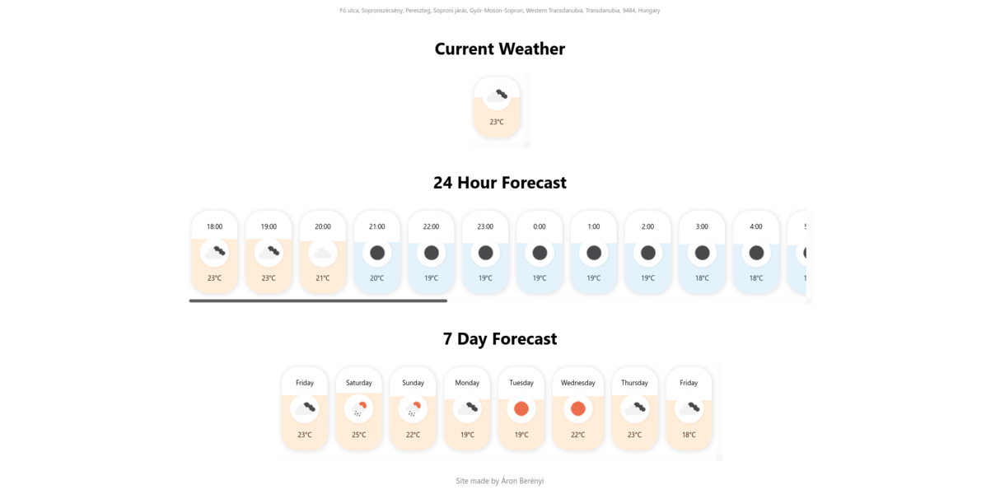

# Weather homepage
A simple page, showing the current weather, a 24 hour and a 7 day forecast.
## Preview

## Technology

* React.js
* Typescript
* Styled components
* OpenWeather API
* Location IQ API

## Description

I made this small project to get more familiar with Typescript, and because it was a small task given to me. I had fun, Typescript is quite helpful and useful technology which isn't particularly hard either.

## Available Scripts

In the project directory, you can run:

### `npm start`

Runs the app in the development mode. 
Open [http://localhost:3000](http://localhost:3000) to view it in the browser.

The page will reload if you make edits. 
You will also see any lint errors in the console.

### `npm run build`

Builds the app for production to the `build` folder. 
It correctly bundles React in production mode and optimizes the build for the best performance.

The build is minified and the filenames include the hashes. 
Your app is ready to be deployed!

See the section about [deployment](https://facebook.github.io/create-react-app/docs/deployment) for more information.

